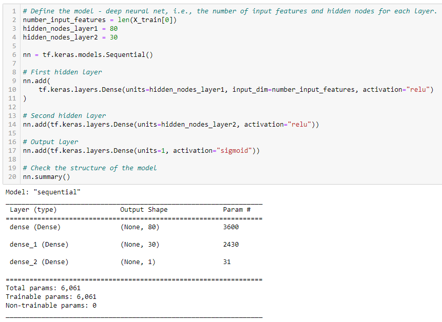
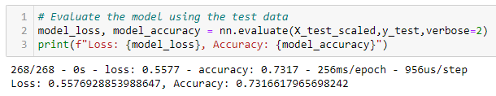
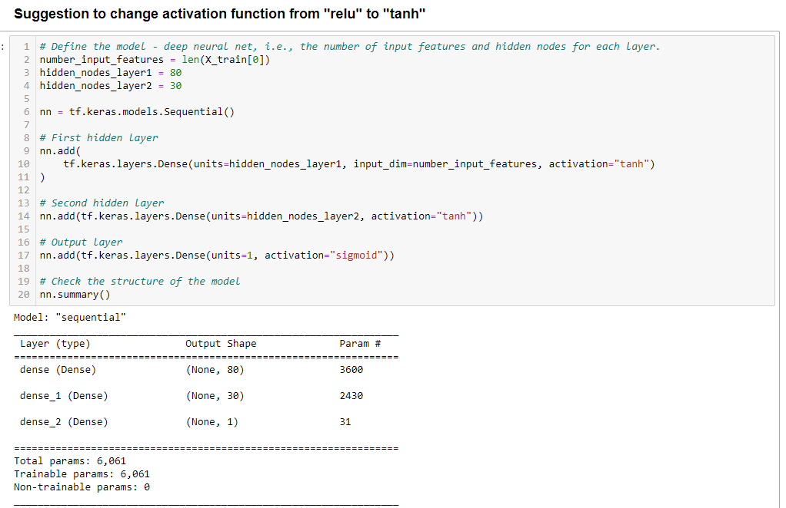
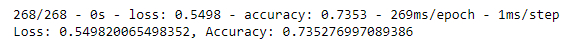
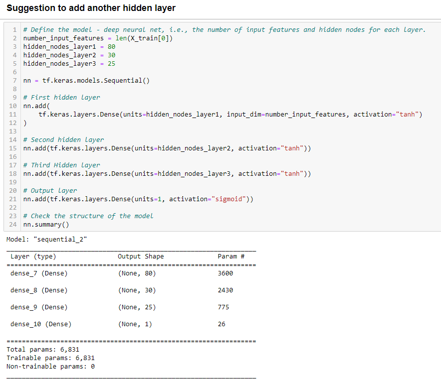
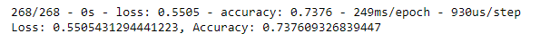
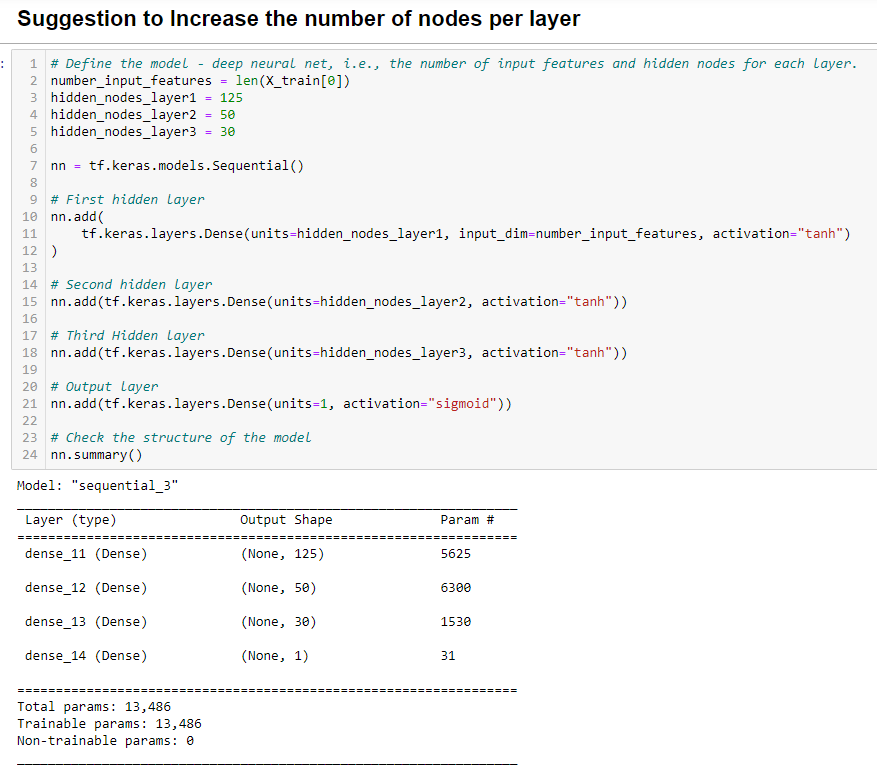
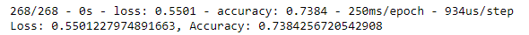

# Neural Network Charity Analysis

## Analysis Overview
Using deep learning and neural networks via the TensorFlow platform in Python, an analysis of the data in the `charity_data.csv` to classify the success of charitable donations. This information will help predict whether the applicants will be successful if funded by AlphabetSoup.

Three Steps to Accomplish Analysis:
1. Preprocessing Data for a Neural Network Model
2. Compile, Train, and Evaluate the Model
3. Optimize the Model

## Results

### Data Preprocessing

* Variable considered target of model: `IS_SUCCESSFUL` Column
* Variables considered features of model: All other columns except for `IS_SUCCESSFUL` Column
* `EIN` and `NAME` columns were dropped and were not used as targets or features of the model.

### Compiling, Training, & Evaluating the Model

* For the original neural network, there were 2 hidden layers with 80 neurons in the first layer and 30 neurons in the second layer. There was also an output layer. The first and second hidden layers have the *RELU* activation function and the output layer has the *SIGMOID* activation function.

* I was not able to acheive the 75% target model performance. 

### Below are the steps I took to try and acheive this target.

#### Step 1: Change Activation Function of Layers 1 & 2 to `Tahn` Instead of `Relu`

**Result of Step 1 Change**: While changing the Activation function to `Tahn` from `ReLU` did increase the accuracy from **73.17%** in the original model to **73.53%** in the new model, it still did not get to the target of **75%**. 

#### Step 2: Add Another Hidden Layer with 25 Neurons w/ `Tahn` Activation

**Result of Step 2 Change**: While adding the extra hidden layer did increase the accuracy from **73.53%** in the Step 1 Model to **73.76%** in the new model, it still did not get to the target of **75%**. 

#### Step 3: Increase Number of Nodes per Hidden Layer

**Result of Step 3 Change**: While increasing the number of neurons per hidden layer did increase the accuracy from **73.76%** in the Step 2 Model to **73.84%** in the new model, it still did not get to the target of **75%**. 

## Summary
In summary, the deep learning neural network did not reach the 75% target model performance. After optimization the percentage did slightly increase but not in a significant way. Another option that could be used to optimize the model is trying to remove features or adding or replacing data in the dataset that might skew the model. This insignificant change in the accuracy could be due to overfitting the model. Another recommendation is that `Random Forest` classifiers be used on the data. This model is more accurate due to the number of estimators and tree depth it has.

